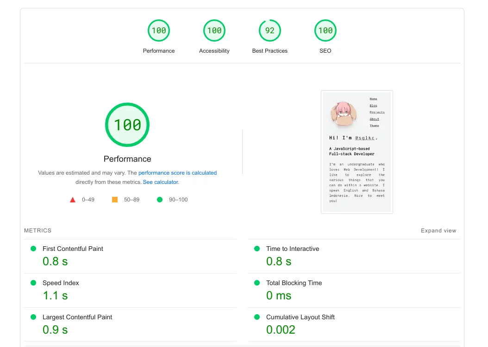
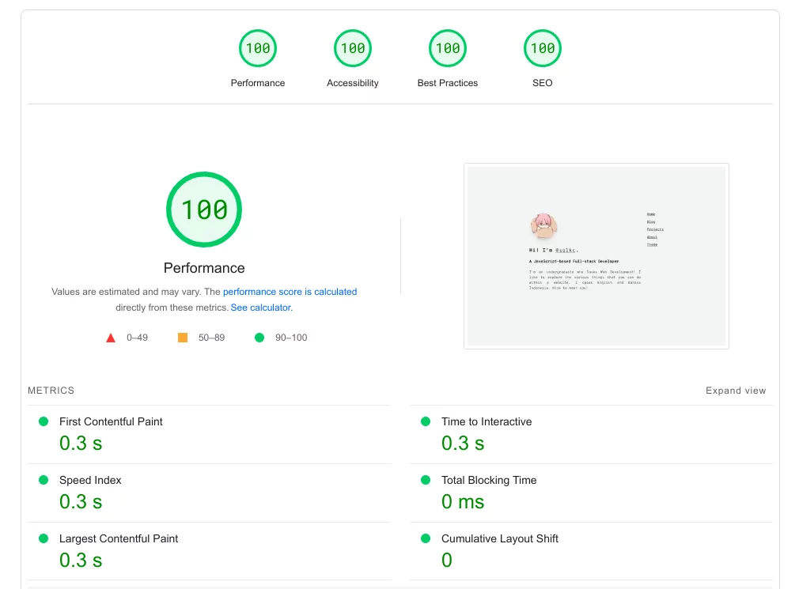
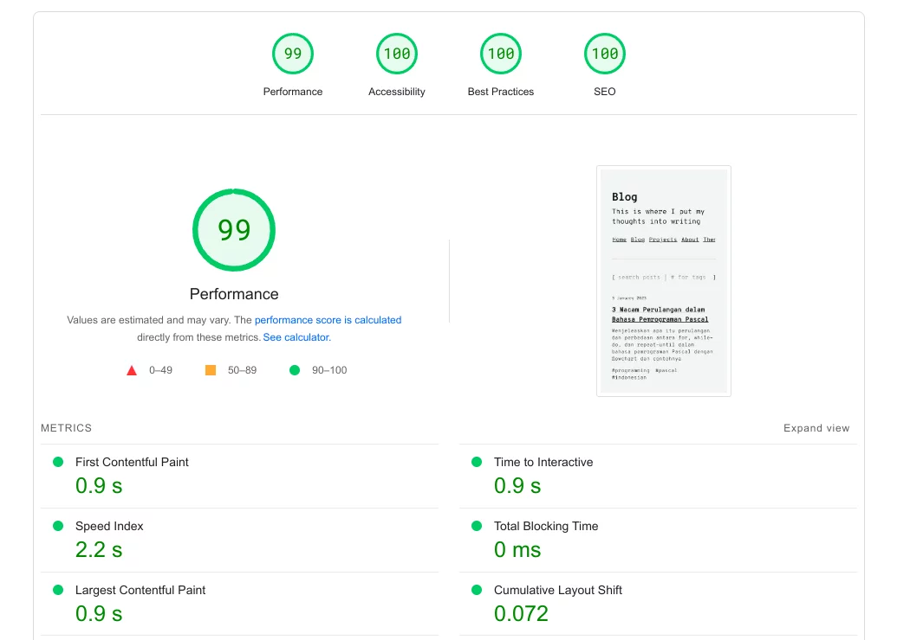
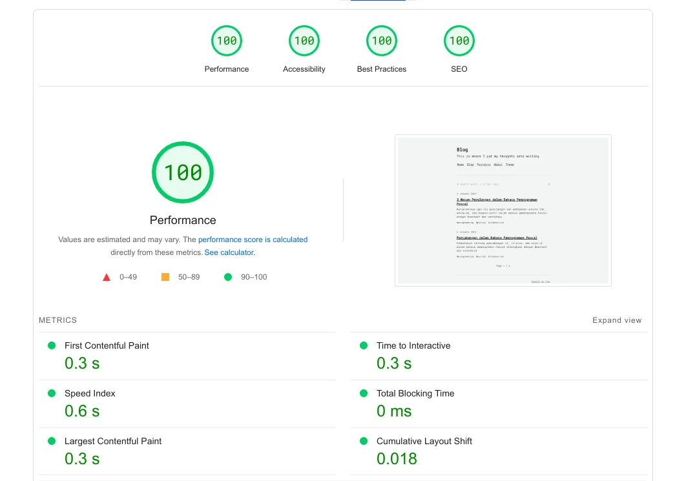
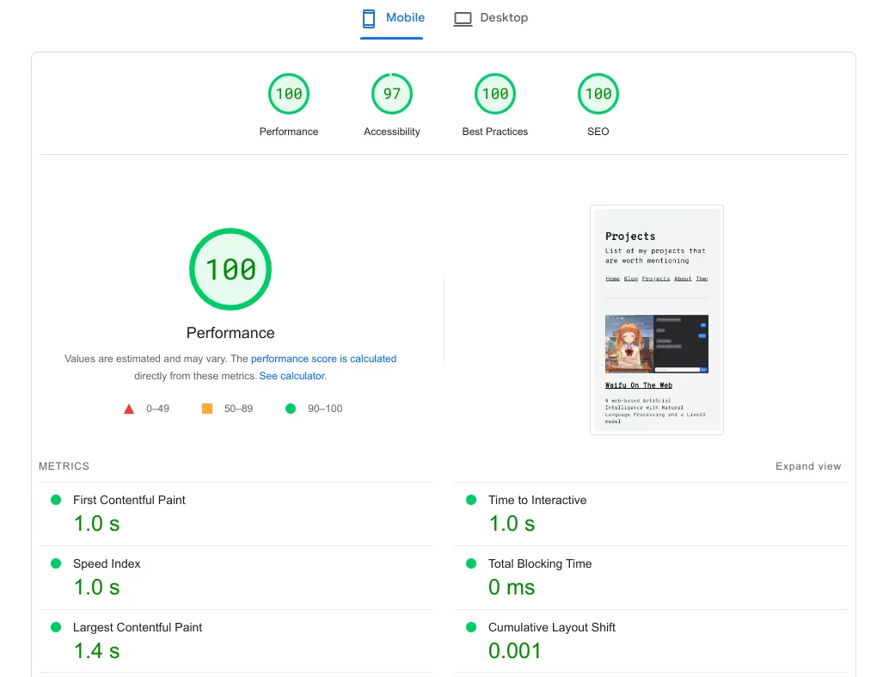
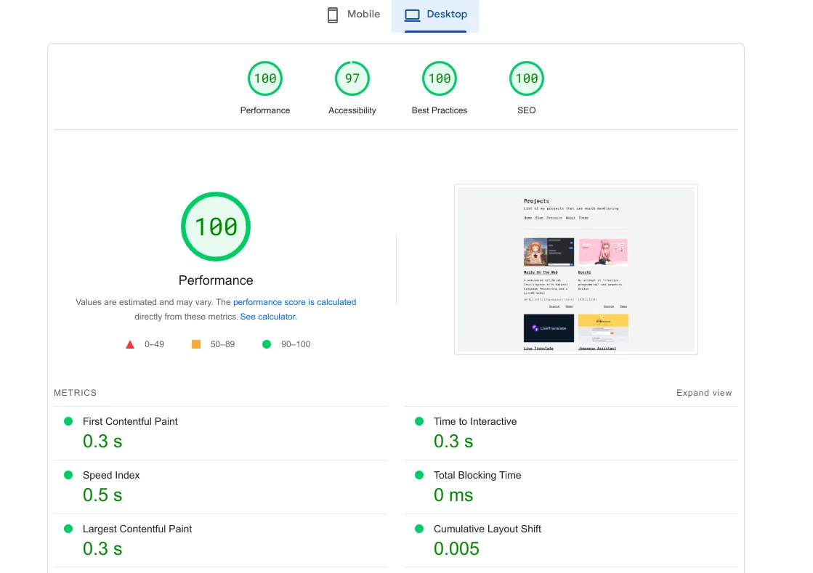

# sglkc.my.id

Blog and project showcase website.

Made with TypeScript, Astro, Preact, MDX, and UnoCSS. Deployed to Netlify.

## PageSpeed Insights

These benchmarks were made by [PageSpeed Insights](https://pagespeed.web.dev).
Last updated on January 24 2023 ([`5eccbf2`](https://github.com/sglkc/blog/commit/5eccbf2d8e6d5c91cb75ea51723b2ecfd14eb720)).

| Page     | Mobile                        | Desktop                        |
|----------|-------------------------------|--------------------------------|
| Index    |     |     |
| Blog     |      |      |
| Projects |  |  |

## Inspirations

- [elianiva](https://elianiva.my.id)
- [TinyRocket](https://tinyrocket.pages.dev/) for prototype design
